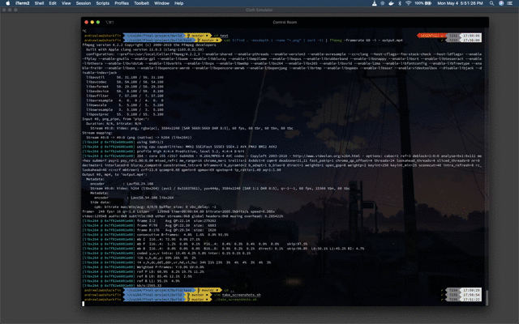

# CS184 Final Project - Position Based Fluids Simulation

Austin Cheng
Andrew Law
Merryle Wang

## Abstract

For our final project, we chose to implement the algorithm in the Position Based Fluids paper by Macklin and Muller. The main contribution of the paper is a method to simulate fluid behavior based on density constraints (incompressibility) as well as viscosity and vorticity constraints. They assert that their method "allows similar incompressibility and convergence to modern smoothed particle hydrodynamic (SPH) solvers, but inherits the stability of the geometric, position based dynamics method, allowing large time steps suitable for real-time applications."

## Technical Approach

We divided the project into 4 major parts:

Part 1 focused on modifying the cloth simulation project to suit our purposes. 

Part 2 focused on implementing the physics for the particles based on the Position Based Fluids paper.

Part 3 focused on tweaking hyperparameters to improve the simulation's realism

Part 4 focused on using shaders and textures to make the simulation look better

### Part 1 - Skeleton Code

The process of starting the project was probably one of the hardest parts. With such an open ended project, it was difficult for us to decide how to approach it. We decided that using the code from the cloth simulation class project might be the best way to proceed. In order to suit it for our purposes, we first identified the files needed to be modified. 

In `main.cpp`, we recognized that the program was parsing the `json` files in `scene/`. Therefore, at first, we just reused the rendering code for the `Sphere` class from the cloth simulation project as the particles, and added a new statement to the big switch case in `main.cpp` to identify parameters for the particles. We also added a keyword called `box` to pass in parameters for the bounding box of the fluid.

Like in the cloth simulation project, we store our particles as a vector owned by the `Cloth` class (which should be renamed to `Fluid`, or something more suitable to the project). This replaces the point mass vector that was previously used to represent the "particles" of the cloth. To get these to actually render on the GUI, we modify `drawContents` in `clothSimulator.cpp` to loop over the vector of particles and call each one of their `render` methods (which we borrowed from the `Sphere` class and then modified). I'm not sure if it is feasible to do here, but we could have used a `#pragma omp for` directive on this loop to make rendering faster. 

The bulk of the coding was to be done in what used to be `cloth.cpp`. Here, the `simulate` function is where the physics happens. In project 4, we used verlet integration to calculate the position of the point masses in the next time step. In this project, we do something similar, but instead of verlet integration, we use the algorithm proposed in the Position Based Fluids paper.

### Part 2 - Position Based Fluids Physics

    // Physics functions
    double poly6(Vector3D r);
    Vector3D spiky_gradient(Vector3D r);
    double get_particle_lambda(const Particle& p);
    double C(const Particle& p);
    Vector3D gradient_C(const Particle& p, const Particle& k);
    Vector3D get_delta_p(const Particle& p);
    double tensile_instability_correction(const Particle& p, const Particle& neighbor);
    void apply_vorticity_confinement(Particle& p, double delta_t);
    Vector3D get_viscosity_correction(const Particle& p);

The above helper functions were used to implement the pseudocode provided by the Position Based Fluids paper, shown below.

The first step of the algorithm, as shown in the paper, is to calculate the new velocity based on external forces. In our case, the only external force we will be applying is gravity, at a constant -9.8 m/s2 in the y direction. 

    for (Particle& p : particles) {
        for (Vector3D external_accel : external_accelerations) {
        external_accel = dot(external_accel, p.on_incline_direction) * p.on_incline_direction;
        Vector3D external_force = mass * external_accel;
        p.velocity += delta_t * external_force;
        }
        p.last_position = p.position;
        p.pos_temp = p.position + delta_t * p.velocity;
    }

Then, the paper suggests that we keep track of an x* for each particle that represents its position while it is going through the steps of the algorithm. We will refer to this value as `pos_temp`.

The rest of the algorithm relies on knowing the "neighbors" of each particle. We define a "neighbor" as a particle xj that is within some distance *h* of the current particle xi. Whether i != j is a formal constraint is a detail that I believe is different from implementation to implementation. Our implementation enforces this constraint. A naive approach is to loop over the particle vector, calculating this distance test for each one. Unfortunately, this approach is quadratic in complexity and once the number of particles approaches even around 1000, the simulation becomes much too slow, as this calculation happens at ***every time step***. Thus, we implemented the spatial hashing that was also present in project 4. After calling `build_spatial_map` and `build_neighbor_map`, each particle in the simulation will have a field `neighbors`, which is a vector of pointers to particles that are close enough to it to be identified as a neighbor.

The next step of the algorithm is to calculate the "incompressibility" constraint, which approximately enforces a specified density of the particles in relation to one another. This is captured in the following code snippet -

    for (Particle& p : particles) {
      p.lambda = get_particle_lambda(p);
    }
    for (Particle& p : particles) {
      p.delta_p = get_delta_p(p);
      p.pos_temp += p.delta_p;
    }

The reason that there are two separate for loops is that the get_delta_p function relies on the lambdas of the particles. Thus, it is necessary that all labmda values are calculated before we start calculating delta_p.

The lines that come direclty afterwards enforce collision detection and are omitted for brevity.

Lambda values are calculated as such

The numerator is calculated as such 

The denominator is calculated as such

rho0 is defined as the rest density of the fluid, and is a user specified parameter. More discussion on this in the next section.

The W function and del W function are the poly6 and spiky kernel functions, respectively, and are implemented in `cloth.cpp`. 

    // `W` kernel density function
    // https://nccastaff.bournemouth.ac.uk/jmacey/MastersProjects/MSc15/06Burak/BurakErtekinMScThesis.pdf
    double Cloth::poly6(Vector3D r) {
    double h = NN_RADIUS;
    double r_norm = r.norm();
    if (r_norm < 0 || r_norm > h) {
        return 0;
    }
    return (315 / 64 / PI / pow(h, 9)) * pow(h*h - r_norm*r_norm, 3);
    }

    // Spiky kernel for gradient calculation
    // https://nccastaff.bournemouth.ac.uk/jmacey/MastersProjects/MSc15/06Burak/BurakErtekinMScThesis.pdf
    Vector3D Cloth::spiky_gradient(Vector3D r) {
    double h = NN_RADIUS;
    double r_norm = r.norm();
    if (r_norm == 0) {
        r_norm = EPS_D;
    }
    if (r_norm < 0 || r_norm > h) {
        return Vector3D(0);
    }
    return -(45 / PI / pow(h, 6)) * (r / r_norm) * pow(h - r_norm, 2);
    }

Once we have the lambda values for each particle using the methods above, we plug these into the delta_p formula to find the correction in position we need to apply to enforce the density constraint.

One problem that appears after this position update is particle clumping, which occurs when particles don't have enough neighbors around themselves to satisfy the rest density. They overcompensate by coming way too close together. To combat this, the Position Based Fluids paper add a "tensile incompressibility constraint" to the delta_p function.

    double Cloth::tensile_instability_correction(const Particle& p, const Particle& neighbor) {
    double k = 0.1; // 0.1 suggested in the paper
    int n = 4;      // suggested in the paper
    Vector3D delta_q = Vector3D(0.11547) * NN_RADIUS; // magic number calculated using heuristic in the paper
    double numerator = poly6(p.pos_temp - neighbor.pos_temp);
    double denominator = poly6(delta_q);
    return -k * pow(numerator / denominator, n);
    }

There are three configurable parameters in this function: `k`, `n`, and `delta_q`. I went with the parameters suggested in the paper. More on this in the next section.

The final steps of the algorithm are to apply vorticity and viscosity confinements. This helps to offset the "additional damping which is often undesirable" introduced by position based methods.

    void Cloth::apply_vorticity_confinement(Particle& p, double delta_t) {
    // calculate w
    Vector3D result_omega = Vector3D(0);
    for (Particle* neighbor_ptr : p.neighbor_ptrs) {
        Vector3D velocity_diff = neighbor_ptr->velocity - p.velocity;
        Vector3D spiky_result = spiky_gradient(p.pos_temp - neighbor_ptr->pos_temp);
        result_omega += cross(velocity_diff, spiky_result);
    }
    Vector3D N = result_omega;
    double N_norm = N.norm();
    if (N_norm > 0.00001) { // prevent division by 0
        N.x /= N_norm;
        N.y /= N_norm;
        N.z /= N_norm;
    } 
    Vector3D corrective_force = cross(N, result_omega);
    p.velocity += delta_t * corrective_force;
    }

    Vector3D Cloth::get_viscosity_correction(const Particle& p) {
    double c = 0.001; // 0.01 suggested in paper
    Vector3D retval = Vector3D(0);
    for (Particle* neighbor_ptr : p.neighbor_ptrs) {
        Vector3D velocity_diff = neighbor_ptr->old_velocity - p.old_velocity;
        double poly6_result = poly6(p.pos_temp - neighbor_ptr->pos_temp);
        retval += velocity_diff * poly6_result;
    }
    retval *= c;
    return retval;
    }

### Part 3 - Hyperparameters

Hyperparameters influence the behavior of the simulation tremendously. Changes in one parameter such as `rest_density` (rho_0 in the paper) or `epsilon` wildly affect the behavior of the particles. While experimenting with the parameters, we got extremeley strange behavior. If the viscosity and vorticity corrections were too high, the energy of the system would explode, and the fluid particles would move way too fast and rocket off the screen. This also could happen in the very first time step of the system if the `rest_density` parameter was too low. Another parameter we experimented with was the EPSILON parameter that is present in the denominator of the particle lambda equation. If it was too low compared to the density, we got behavior where the simulation did not at all resemble fluid and instead resembled some sort of jello. We tried many sets of different parameters, but eventually settled on parameters found on a Stanford website.

    // https://graphics.stanford.edu/courses/cs348c/PA1_PBF2016/index.html
    const double PARTICLE_RADIUS = 0.031;
    const double NN_RADIUS = 0.1;
    const double REST_DENSITY = 6378;
    const double EPSILON = 600;
    const double INIT_OFFSET = PARTICLE_RADIUS * 3;
    const double VISCOSITY_CORRECTION = 0.001;

These parameters gave satisfactory results that looked at least believable. Note that the viscosity correction is one order of magnitude smaller than what is suggested in the paper.

### Part 4 - Rendering fluids with Shaders
We intended to render the fluids from the host of particles by following the technique that the paper followed: Ellipsoid Splatting. Unfortunately, we realized that the given the deadlines we had to meet and the existing codebase would make it very difficult to complete this task. After doing some research, it seemed that to render the fluid, we should have used Blender or Mitsuba to approach our project, not the project 4 starter code as the backbone of our code. In addition, the computing power of our computers was not enough to support a large amount of particles at a decent speed, which would severly reduce the realism even with the complete rendering. We decided to take a more experimental approach. Rather than follow existing methods and approaches for rendering the fluids from the particles that we already had, we decided to play around with the shaders in GLSL that were already integrated with our code base to try and approximate the ellipsoid splatting.

After a lot of experimentation, this is one approach we ended up using. 

- Finding a handsome water-esque texture online, we formatted it into a cube map to use along with the mirror shader.
- Adding a displacement mapping to the particles, creating a more full effect by increasing the radius
- Creating a more ellipsoid shape to replicate the ellipsoid splatting

This was the most standard, stable approach. While it still didn't look like water, with certain parameter tuning, there were a decent bubbly looking liquid. 

This is another more wild approach that we tried.

- Applying the same texture using the mirror shader
- Adding random 3d vector generator based off of a random 2d vector, and it takes in the world space position of the vertex as the input each time
- Now each fragment in the shader has this random generally ellipsoid shape to it that changes with every time step. 
- I had hoped that this could add some fluidly and fill the holes that were created by the individuals particles

Here's the code for it:

In the end, none of the shading were implemented could replicate what the research paper did, but that was to be expected. The result certainly did look better than just the plain particles though.

## Results

On our first attempt, our results were extremely lackluster and looked wrong. Eventually, after playing with the hyperparameters, we realized that they were at fault, since our physics functions and algorithm seemed to be implemented correctly. After setting the parameters to what is described above, we got some realistic looking results.

1000 particles, dampened (pre vorticity and viscosity adjustment)

4 slide scenario

3500 particles

3500 particles, Stable Pseudo-Ellipsoid Splatting approach looking kind of bubbly

Wild Pseudo-Ellipsoid Splatting approach giving us some nasty looking fluid

I went through a lot of pain to get these videos because of my incompetence. At first, I tried to be fancy and take screenshots by dumping pixel values into a file, and then writing a python script to convert the values back to a png. After multiple hours of failure, I used my brain. Sometimes, simpler is better. I literally just recorded me hitting `P` on the simulation and called it a day. To do this, I wrote a bash script to take a screenshot every .05 seconds, and then stitched together the png files using ffmpeg.

## References

- [Position Based Fluids Paper (Macklin and Muller, NVIDIA)](https://mmacklin.com/pbf_sig_preprint.pdf)

- [Stanford Course Parameters](https://graphics.stanford.edu/courses/cs348c/PA1_PBF2016/index.html)

- [Poly6 and Spiky Gradient Functions](https://nccastaff.bournemouth.ac.uk/jmacey/MastersProjects/MSc15/06Burak/BurakErtekinMScThesis.pdf)

## Contributions

Andrew - Skeleton code rearchitecture, physics implementation, generated videos with scripts

Austin - Skeleton code rearchitecture, spatial mapping, slide scene creation

Merryle - Spatial mapping, special shaders for rendering fluids, parameter tuning
