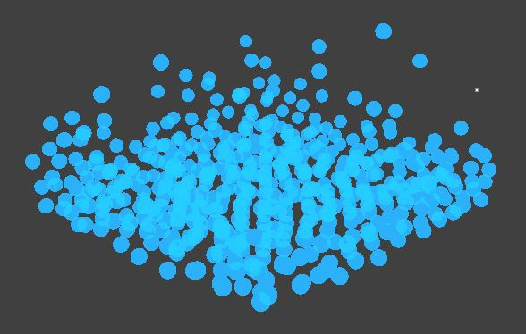
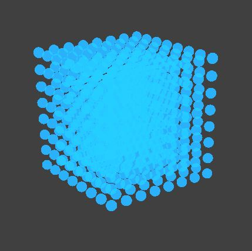

Team Members: Andrew Law, Austin Cheng, Merryle Wang

## What we have accomplished & preliminary results

We have finished implementing the physics in **Position Based Fluids, Macklin & Muller (2007)**. The particle based physics we have coded up handles incompressiblility, tensile instability, vorticity confinement, and viscosity to make our particles look like water when it is rendered. Our simulation loop handles an applying of forces on the scene—the default is just gravity—and then applies the 5 iteration solver for handling the constraints of water. Finally we update the velocities and apply some more corrections, and then update the position for that time step. Currently, our standard setup is an 8 by 8 by 8 array of particles that we let fall into a box. We have also implemented a spatial hash map similar to the one in assignment 4 to speed up the code and will eventually allow us to generate a lot of particles at a reasonable speed.

We took the starter code for assignment 4, and we built on top of it for our project. We created a new particle class, that is similar to the sphere class, and we use a json file to set up and specify the scene. Our box is formed with planes that aren’t rendered on the screen. So the json file for the scene pictured on at the top of page consists of a box (created by some planes) and a particles (builds a 3d grid of particles). We editted the parsing code for the json file in order to fit our purposes for this project.

## Things Left to Do

Since we have completed the first main task of our project, the second main task remaining is rendering the particles as water and not just a bunch of small balls. We are basically on schedule cause we said to work on the rendering around 4/28. So this is the next thing we have to tackle. There are a lot of resources out there that describe how to render water from particles, but we will likely use the ellipsoid splatting technique because this is the way our base paper rendered the particles. Ellipsoid splatting seems to be a type of rasterization where you don’t cleanly map a particle to a pixel, but rather “splat” it. This will let our scene look more like water than a lot of small blue spheres.

If we finish this rendering reasonally quickly, we would like to add the ability to apply different forces to the water besides just gravity. The paper we based our project off of seems to have some side to side shaking capability. 

## Remaining Schedule
1. Rendering so that it looks like water (May 2)

2. Work on presentation & deliverables (May 7)

## Video and Presentation Slides
[Presentation](https://docs.google.com/presentation/d/1AVGYC2m6_7dXv4_j0M80rZT4XRSCF1Swt-rL6er98Zk)

[Video](https://youtu.be/nTayrP6n23Q)

